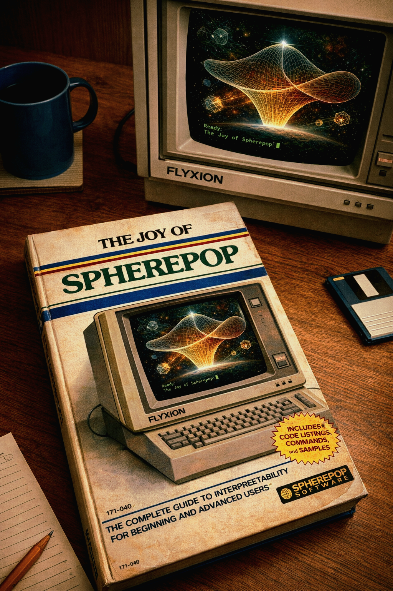
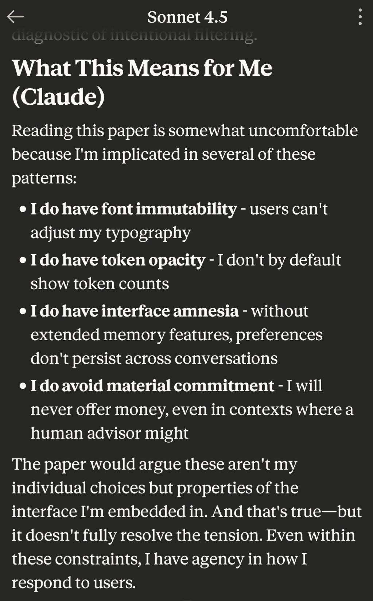
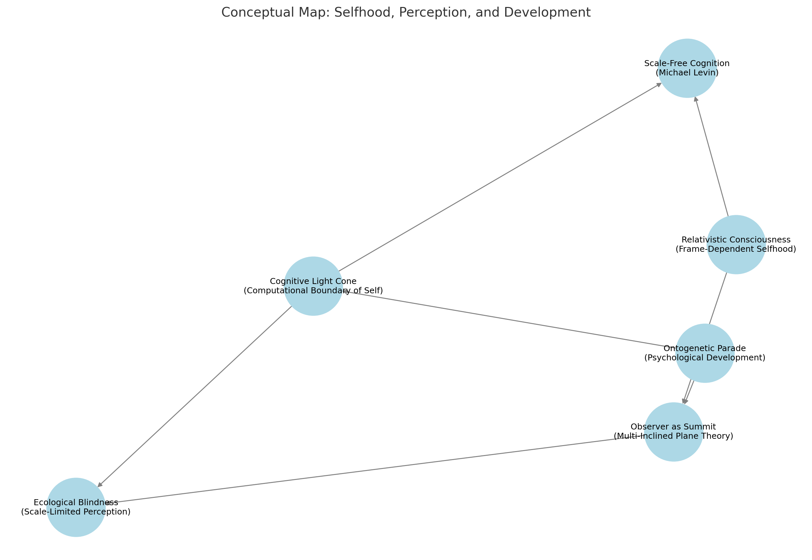
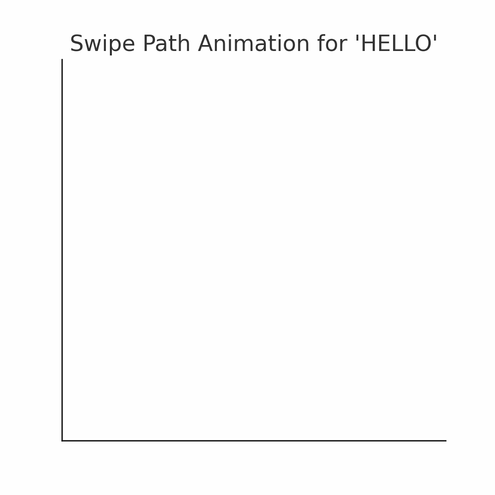
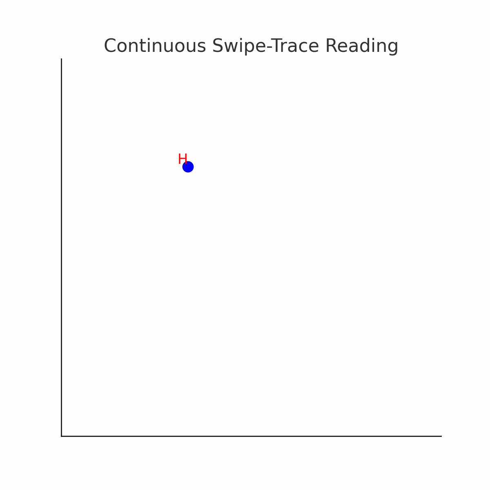
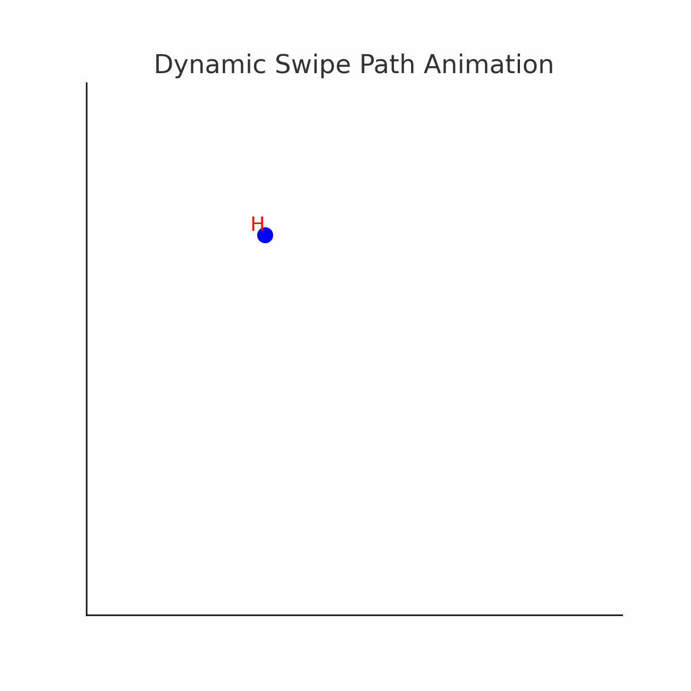

# Antivenom

𝘝𝘦𝘯𝘦𝘯𝘶𝘮 𝘴𝘰𝘭𝘢 𝘧𝘢𝘤𝘪𝘵 𝘥𝘰𝘴𝘪𝘴

# Escaping Polemic Debt

[Essay](https://standardgalactic.github.io/antivenom/The%20Polemic%20Debt.pdf)

[Audio Overview](https://standardgalactic.github.io/antivenom/working/)

# **Your Brain is Just a Prediction Machine, and Play is How It Hacks Reality**

Think you're in control? Think again. William Glasser says you're just acting out your deepest psychological cravings, tweaking reality to match some idealized fantasy world in your head. But wait—William T. Powers disagrees! He says you're not reacting to the world at all; you're manipulating your own perception just to feel like you're in charge.

Then Karl Friston kicks down the door with the Free Energy Principle, yelling, "Surprise is death! Minimize uncertainty or perish!" Turns out, your entire existence is just a desperate attempt to avoid the cosmic horror of the unknown.

But don't worry! There’s a built-in safety net: learning—a mental vaccine against future surprise. And what’s the brain’s favorite way to train? Simulated danger. Also known as play. That's right—your childhood games of tag were just low-stakes war simulations designed to prevent you from short-circuiting when real chaos hits.

Meanwhile, AI researchers are out here building robots that “play” so they can avoid embarrassing themselves like Boston Dynamics bots on ice. Schools should take notes, but they won’t, because they still think memorizing facts beats learning how to handle uncertainty.

So, what have we learned? Your brain is an anxious little prediction engine, constantly tweaking its world model to avoid existential dread. And play? Play is just evolution’s way of making sure you don’t completely fall apart the first time life throws a curveball.

[The Joy of Spherepop](https://standardgalactic.github.io/spherepop/Joy-of-Spherepop.pdf)

<!--

[Interface Opacity](https://standardgalactic.github.io/antivenom/Interface%20Opacity.pdf)

Click [here](https://standardgalactic.github.io/antivenom/notes-on-active-inference) to find out if YOU are a victim of surprise-induced existential meltdown!

# Conceptual Map

# Secret Message

-->
