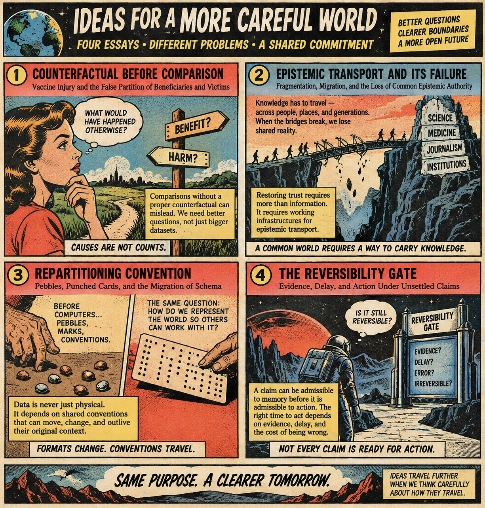

# Rhetoric

[Counterfactual Before Classification: Vaccine Injury and the False Partition of Beneficiaries and Victims](https://standardgalactic.github.io/antivenom/rhetoric/counterfactual-before-comparison.pdf)

[Epistemic Transport and Its Failure: Fragmentation, Migration, and the Loss of Common Epistemic Authority](https://standardgalactic.github.io/antivenom/rhetoric/epistemic-transport.pdf)

[Repartitioning Convention: Pebbles, Punched Cards, and the Migration of Schema](https://standardgalactic.github.io/antivenom/rhetoric/repartitioning-convention.pdf)

[The Reversibility Gate: Evidence, Delay, and Action Under Unsettled Claims](https://standardgalactic.github.io/antivenom/rhetoric/reversibility-gate.pdf)

